WPygments - Wordpress syntax highlighter based on [Pygments](http://pygments.org/ "")
======================
Server side syntax highlighter based on Pygments highlighter software.

## Installation:
To use this plugin you need pygments in your server:

```
sudo apt-get install python-setuptools
easy_install Pygments
```

That's all. Now you can download the plugin and install it in your Wordpress.

## Usage
Once you get installed the plugin the usage is straightforward. just enclose your code between tokens named with the corresponding lang:

[javascript]....[/javascript]

[php]....[/php]

See "Languages and filetypes supported" section to know available languages.

#### Parameters
Tokens support a few parameters (all optionals):

[php **style**="manni" **linenumbers**="table"]....[/php]

`style="manni"` defines code styling. Currently are 19 available styles.<br>
Default styling is `default` wich is very nice, but maybe you like other styles. see "Color styles" section.

`linenumbers="false"` indicates if it should show the numbers and which format. `linenumbers="table"` or `linenumbers="inline"`

#### Examples
```
[javascript]
//comment line
var foo = "foo";
var bar = function(){
	var baz;
}
[/javascript]
```

Outputs highlighted js with **default** style, and **no** (false) linenumbers.

```
[javascript style="monokai" linenumbers="inline"]
//comment line
var foo = "foo";
var bar = function(){
	var baz;
}
[/javascript]
```
Outputs highlighted js with **monokai** style, linenumbers.

And so on.

##Color styles
These are supported color styles:

* `monokai`<br>
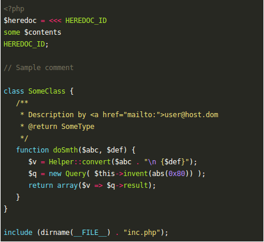

* `manni`<br>
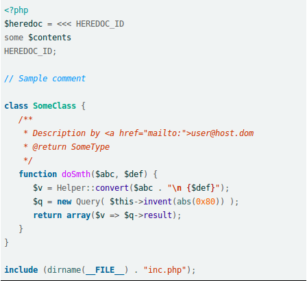

* `rrt`<br>
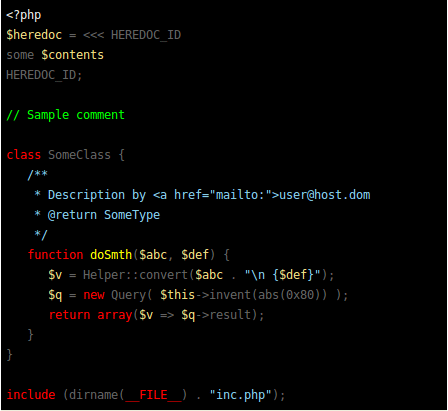

* `perldoc`<br>
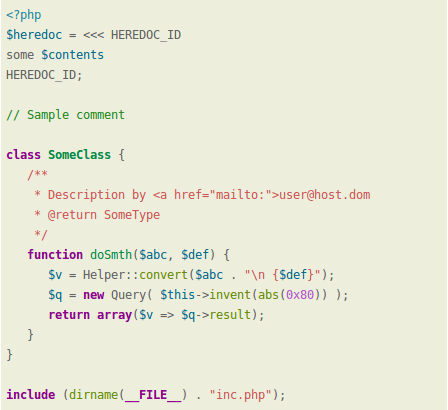

* `borland`<br>
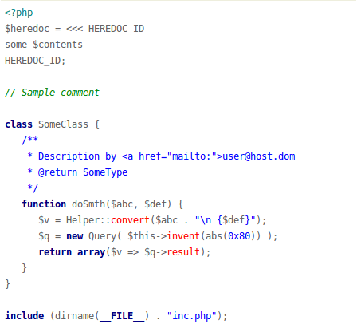

* `colorful`<br>
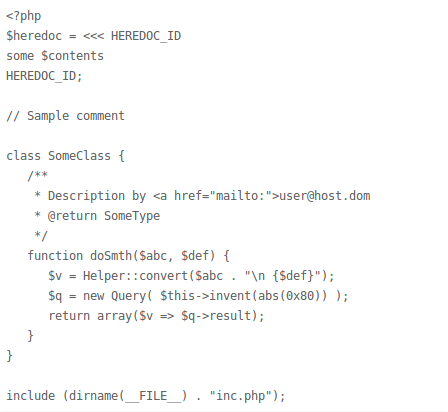

* `default`<br>
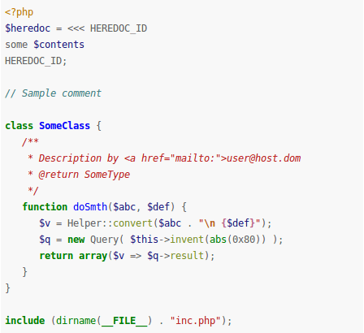

* `murphy`<br>
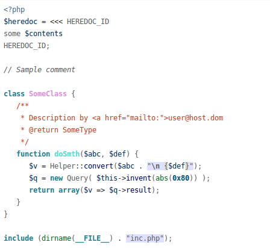

* `vs`<br>
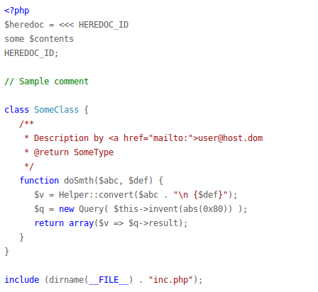

* `trac`<br>
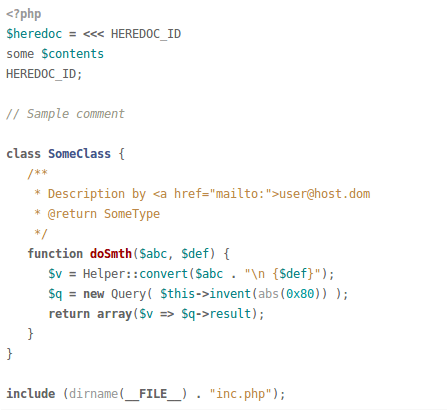

* `tango`<br>
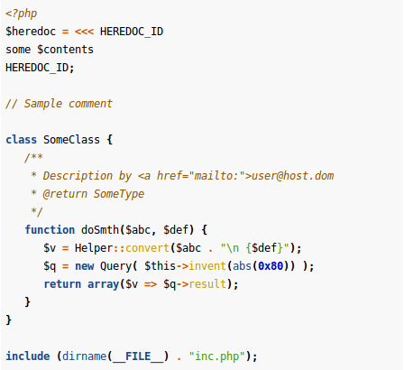

* `fruity`<br>
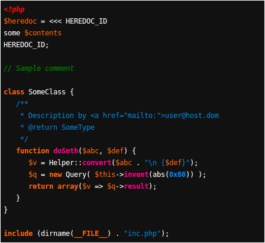

* `autumn`<br>
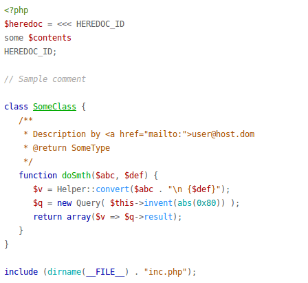

* `bw`<br>
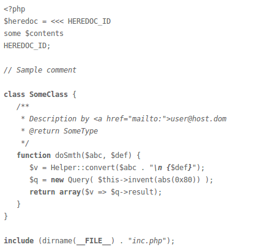

* `emacs`<br>
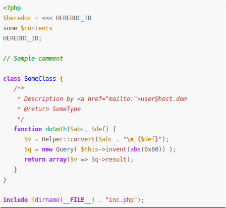

* `vim`<br>
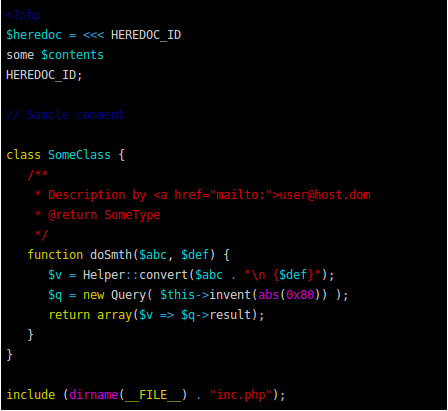

* `pastie`<br>
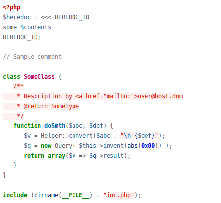

* `friendly`<br>
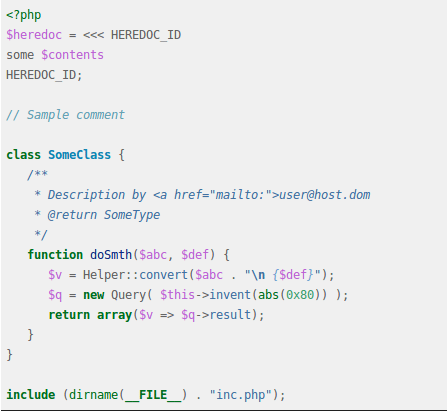

* `native`<br>
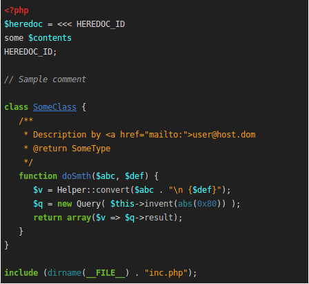


##Languages and filetypes supported

Pygments not only highlights languages. also highlights filetypes like .conf **Nginx** configuration file, **Apache** (filenames .htaccess, apache.conf, apache2.conf), etc.

NOTE: to use see "Usage" section

#####important sdsd;
#####General
* `apacheconf`: (.htaccess, apache.conf, apache2.conf)
* `bash`, `sh`, `ksh`:
    (*.sh, *.ksh, *.bash, *.ebuild, *.eclass, .bashrc, bashrc)
* `ini`, `cfg`: (*.ini, *.cfg)
* `makefile`:
    (*.mak, Makefile, makefile, Makefile.*, GNUmakefile)
* `nginx`:
    Nginx configuration file 
* `yaml`:
    (*.yaml, *.yml)
* `perl`:
    Perl (*.pl, *.pm)
* `vb.net`:
    VB.net (*.vb, *.bas)
* `console`:
    Bash Session (*.sh-session)

#####Javascript
* `javascript`: Pure Javascript
* `coffeescript`: Pure CoffeeScript
* `json`: Pure JSON

#####PHP
* `cssphp`: PHP embedded in CSS
* `htmlphp`: PHP embedded in HTML
* `jsphp`: PHP embedded in JS
* `php`: Pure PHP
* `xmlphp`: PHP embedded in XML

#####Ruby
* `ruby`, `duby`: Ruby (*.rb, *.rbw, *.rake, *.gemspec, *.rbx, *.duby)
* `csserb`, `cssruby`: Ruby embedded in CSS
* `xmlerb`, `xmlruby`: Ruby embedded in XML

#####CSS and CSS compilers
* `css`:
    CSS (*.css)
* `sass`:
    Sass (*.sass)
* `scss`:
    SCSS (*.scss)

#####HTML and HTML template systems
* `html`:
    HTML (*.html, *.htm, *.xhtml, *.xslt)
* `haml`:
    Haml (*.haml)
* `jade`:
    Jade (*.jade)

#####SQL
* `sql`:
    SQL (*.sql)
* `sqlite3`:
    sqlite3con (*.sqlite3-console)
* `mysql`:
    MySQL 

#####Python, jinja & Django
* `python`: Pure Python
* `python3`: Pure Python 3 
* `xmldjango`, `xmljinja`: Django/Jinja embedded in XML
* `cssdjango`, `cssjinja`: Django/Jinja embedded in CSS
* `django`, `jinja`: Pure Django/Jinja 
* `htmldjango`, `htmljinja`: Django/Jinja embedded in HTML
* `jsdjango`, `jsjinja`: Django/Jinja embedded in Javascript

#####Java & Groovy
* `java`:
    Java (*.java)
* `groovy`:
    Groovy (*.groovy)
* `jsp`:
    Java Server Page (*.jsp)

#####C, C++, Objetive-c, C Sharp
* `cobjdump`: c-objdump (*.c-objdump)
* `c`: C (*.c, *.h, *.idc)
* `cpp`: C++ (*.cpp, *.hpp, *.c++, *.h++, *.cc, *.hh, *.cxx, *.hxx)
* `csharp`: C# (*.cs)
* `objectivec`: (*.m)

#####XML
* `xml`: (*.xml, *.xsl, *.rss, *.xslt, *.xsd, *.wsdl)
* `xslt`: (*.xsl, *.xslt)


<hr>
Todos
=====
Implement PHPygments.